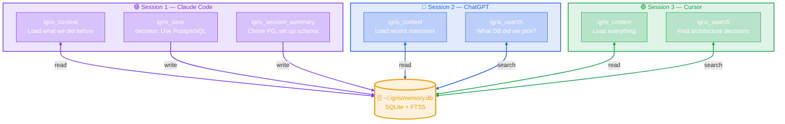
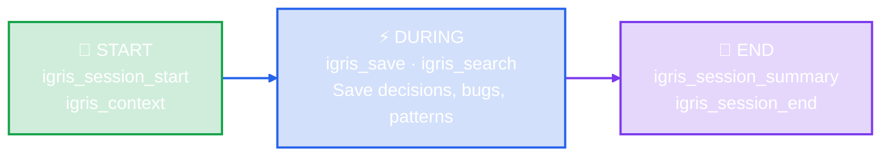
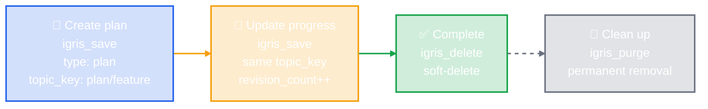
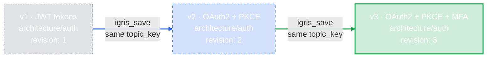
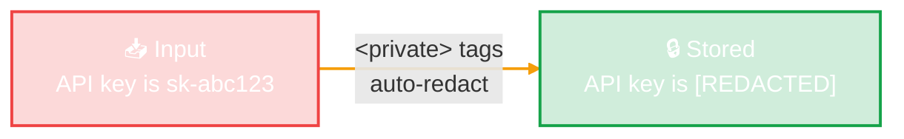
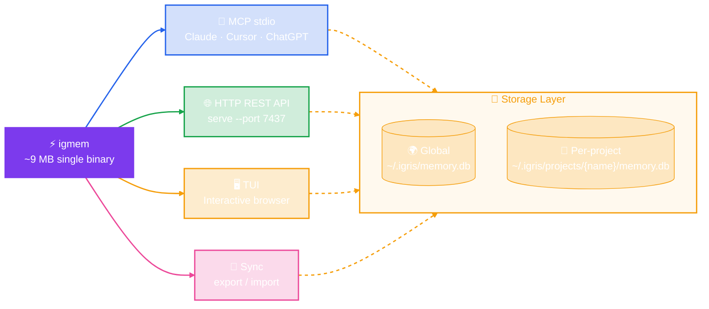

# Igris Memory

> Persistent memory for AI agents. One binary. Works across Claude, ChatGPT, Cursor, and any MCP-compatible tool.

[](LICENSE)

---

## Why?

Every AI conversation starts from zero. Igris Memory fixes that by giving your AI assistant a persistent, searchable memory that works across sessions and providers.

- **No more repeating yourself** — decisions, patterns, and context survive between conversations
- **Provider-agnostic** — same memory for Claude Code, ChatGPT, Cursor, or any MCP client
- **Plans that clean up** — save execution plans, track progress, delete when done
- **Privacy-first** — wrap secrets in `<private>` tags, auto-redacted before storage

## Install

**Shell script** (Linux/macOS — auto-detects architecture):
```bash
curl -fsSL https://raw.githubusercontent.com/getigris/igris-memory/main/dist/install.sh | sh
```

**Homebrew** (macOS/Linux):
```bash
brew install getigris/tap/igris-memory
```

**From source**:
```bash
cargo install --path .
```

**Windows**: download `igris-memory-x86_64-pc-windows-msvc.zip` from [GitHub Releases](https://github.com/getigris/igris-memory/releases), extract `igmem.exe`, and add to your PATH.

The binary is called **`igmem`**.

### Configure with Claude Code

Add to `~/.claude/settings.json`:

```json
{
  "mcpServers": {
    "igris-memory": {
      "command": "igmem"
    }
  }
}
```

### Configure with Claude Desktop

Add to `~/Library/Application Support/Claude/claude_desktop_config.json`:

```json
{
  "mcpServers": {
    "igris-memory": {
      "command": "/usr/local/bin/igmem"
    }
  }
}
```

## How It Works



## Session Lifecycle



## MCP Tools (15)

### Memory Operations

| Tool | Description |
|------|-------------|
| `igris_save` | Save a memory. Called proactively when decisions are made, bugs are fixed, patterns emerge, or plans are created |
| `igris_search` | Search memories by keyword or natural language. Returns ranked results with snippets |
| `igris_get` | Get full content of a memory by ID |
| `igris_update` | Update specific fields of an existing memory |
| `igris_delete` | Soft-delete a memory (use for completed plans, outdated info) |
| `igris_context` | Load recent memories. Called at the START of every conversation |
| `igris_stats` | Memory store statistics by type and project |
| `igris_timeline` | Chronological context around a specific memory |
| `igris_suggest_topic_key` | Generate consistent keys for evolving knowledge |

### Data Operations

| Tool | Description |
|------|-------------|
| `igris_export` | Export all memories as JSON for backup |
| `igris_import` | Import memories with automatic deduplication |
| `igris_purge` | Permanently remove old soft-deleted memories |

### Session Management

| Tool | Description |
|------|-------------|
| `igris_session_start` | Register a new working session |
| `igris_session_end` | Mark session complete with summary |
| `igris_session_summary` | Save structured summary — most important memory for continuity |

## Memory Types

| Type | When to use | Example |
|------|------------|---------|
| `decision` | User makes a choice | "Use PostgreSQL over MySQL" |
| `architecture` | System design is created or changed | "Auth middleware uses JWT with RS256" |
| `bugfix` | A bug is found and fixed | "Fix null pointer in login handler" |
| `pattern` | A reusable pattern emerges | "Error handling: always wrap in Result<T, AppError>" |
| `config` | Configuration is set up or changed | "Redis cluster with 3 nodes on port 6379" |
| `discovery` | Something unexpected is learned | "SQLite FTS5 doesn't support prefix queries by default" |
| `learning` | A concept is explained or understood | "Rust lifetimes ensure references are valid" |
| `plan` | An execution plan is created | "1. Add axum 2. Create routes 3. Add tests" |
| `manual` | User explicitly asks to remember | "Remember: deploy to staging before prod" |

## Plans

Plans are a special memory type designed for execution tracking:



## Topic Keys

Topic keys group evolving knowledge. Saving with the same `topic_key` updates the existing memory instead of creating a duplicate:



Use `igris_suggest_topic_key` to generate consistent keys automatically.

## Privacy

Wrap sensitive values in `<private>` tags — auto-redacted before storage:



## Running Modes

```bash
# MCP server (default) — for Claude Code, Cursor, etc.
igmem

# HTTP REST API — for any HTTP client
igmem serve --port 7437

# Terminal UI — interactive browser
igmem tui

# Sync — export/import for backup or multi-machine
igmem sync export --dir ./my-sync
igmem sync import --dir ./my-sync
```

## Options

```bash
# Custom data directory
igmem --data-dir /path/to/data

# Per-project isolated database
igmem --project-scoped --project my-app

# Encrypted database (SQLCipher)
igmem --db-key "my-secret-key"
# Or: IGRIS_DB_KEY=my-secret-key igmem

# Custom log level
IGRIS_LOG=debug igmem serve --port 7437
```

## Architecture



## Development

See [DEVELOPMENT.md](DEVELOPMENT.md) for full architecture, module map, design patterns, cross-compilation, and release process.

```bash
rustup install stable                  # Rust 1.94+
git config core.hooksPath .githooks    # Activate pre-commit hooks
cargo build --release                  # Build
cargo test                             # Test
cargo clippy -- -D warnings            # Lint
```

See [CONTRIBUTING.md](CONTRIBUTING.md) for contribution guidelines.

## License

[Elastic License 2.0](LICENSE)
